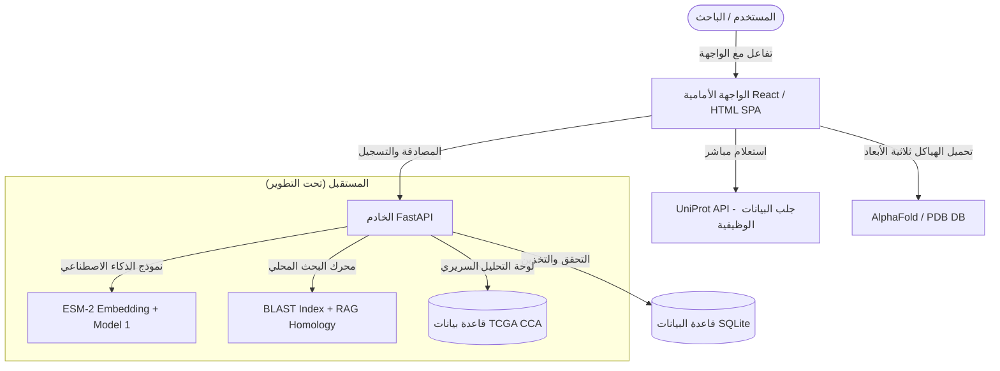
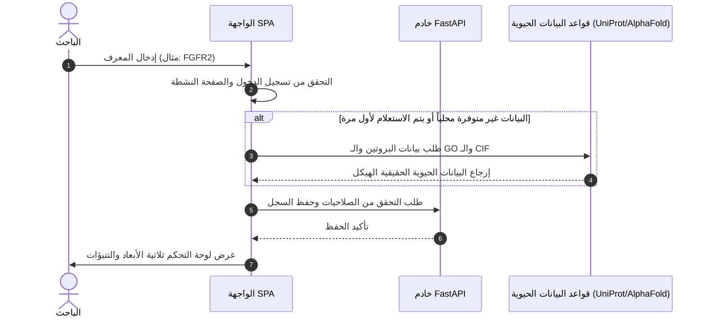
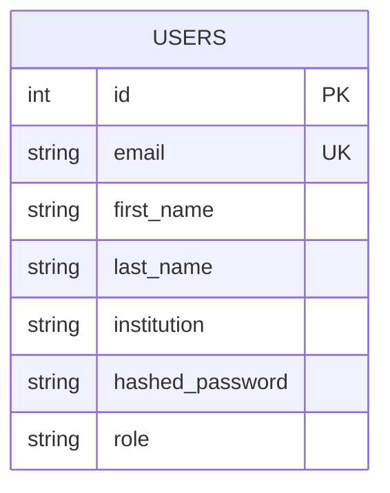

# دليل توثيق مشروع ProtMind — منصة الذكاء الاصطناعي للمعلوماتية الحيوية للبروتينات

هذا المستند يقدم شرحاً شاملاً وتفصيلياً لمشروع **ProtMind**، وهو عبارة عن منصة موحدة للمعلوماتية الحيوية مدعومة بالذكاء الاصطناعي، تهدف بشكل أساسي لدعم أبحاث سرطان القنوات الصفراوية (Cholangiocarcinoma - CCA) من خلال دمج البيانات البيولوجية، والنماذج التنبؤية للبروتينات، والتصور ثلاثي الأبعاد للهياكل الجزيئية في واجهة مستخدم واحدة مدمجة وسهلة الاستخدام.

---

## 🧬 1. نظرة عامة عن المشروع (Project Overview)

يعاني الباحثون في مجال المعلوماتية الحيوية من تشتت الأدوات البيولوجية؛ حيث يتطلب فحص بروتين واحد التنقل بين 4 إلى 6 منصات مختلفة (مثل UniProt للحصول على التسلسل والوظائف، وAlphaFold DB للهيكل ثلاثي الأبعاد، وPyMOL للتصور، وSTRING للتفاعلات البروتينية).

منصة **ProtMind** تجمع كل هذه الأدوات في مكان واحد وتضيف إليها قوة نماذج اللغة الكبيرة للبروتينات (Protein Language Models) مثل **ESM-2** لتقديم:
1. **تنبؤات وظيفية دقيقة للبروتينات** مصحوبة بتفسيرات على مستوى الأحماض الأمينية (Explainability).
2. **تصور ثلاثي الأبعاد** للهيكل مباشرة في المتصفح دون الحاجة لتثبيت برامج مكتبية.
3. **تنبؤات تفاعل البروتينات** ودراسة الطفرات الجينية وتأثيرها على استقرار البروتين.
4. **لوحة تحكم سريرية (Clinical Dashboard)** لتحليل الطفرات وعلاقتها بفرص نجاة المرضى اعتماداً على بيانات TCGA لسرطان القنوات الصفراوية.

---

## ⚙️ 2. البنية البرمجية والتقنيات المستخدمة (System Architecture)

يعتمد المشروع على بنية مفصولة بين الواجهة الأمامية والخلفية (Decoupled Frontend/Backend Architecture):

### المكونات الحالية:
* **Backend**: مبني باستخدام إطار العمل **FastAPI** في بيئة Python، ويعتمد على قاعدة بيانات **SQLite** مع **SQLAlchemy ORM** لإدارة المستخدمين والصلاحيات وإصدار توثيق JWT.
* **Frontend**: واجهة مستخدم سريعة وخفيفة مبنية كـ SPA (Single Page Application) باستخدام **HTML/JavaScript** و**Tailwind CSS** للتصميم العصري المتقدم، بالإضافة إلى **Mol*** لتصور الهياكل ثلاثية الأبعاد و**Google Fonts** للخطوط و**Material Symbols** للأيقونات.

---

## 🛠️ 3. ما تم تنفيذه بالفعل ف المشروع (Implemented Features)

لقد تم بناء الهيكل الأساسي والنظام التفاعلي للمشروع ليعمل كـ **نموذج أولي متفاعل (Interactive MVP Demo)**. إليك بالتفصيل الأجزاء الجاهزة حالياً:

### أ. نظام الواجهة الخلفية (FastAPI Backend):
1. **إدارة حسابات المستخدمين (Authentication & RBAC)**:
   - إنشاء حساب جديد (`/api/auth/signup`) مع حفظ الاسم، والمؤسسة البحثية، والبريد الإلكتروني، وتحديد الصلاحية (Role).
   - تسجيل الدخول (`/api/auth/login`) والتحقق من كلمة المرور المشفرة (bcrypt).
   - التحقق من التوكين وتأكيد الهوية (`/api/auth/me`) وإصدار توكنات **JWT**.
   - تطبيق الصلاحيات الثلاث المذكورة في الشروط: `Researcher` (باحث)، `Clinical Scientist` (عالم سريري)، و`Admin` (مدير).

### ب. الواجهة الأمامية التفاعلية (Frontend SPA):
1. **نظام التنقل والتحكم بالصلاحيات (SPA Router & RBAC)**:
   - واجهة كاملة للتنقل بين الصفحات المختلفة دون الحاجة لإعادة تحميل الصفحة.
   - حظر الصفحات الداخلية في حال عدم تسجيل الدخول.
   - حظر صفحة التحليل السريري (`Clinical`) وعرض رسالة "غير مصرح" للمستخدمين الذين يحملون صلاحية `Researcher`؛ بينما يسمح بالدخول فقط لـ `Clinical Scientist` و `Admin`.
2. **صفحة الهبوط (Landing Page)**:
   - صفحة بداية جذابة ذات طابع علمي وراقي، تعرض إحصائيات المنصة وتفاصيل النماذج وتقدم زر بدء الاستخدام.
3. **محرك البحث الديناميكي (Dynamic Search)**:
   - حقل بحث ذكي في صفحة البحث الأساسية يسمح بإدخال معرف UniProt (مثل `P01308` أو `P35222`) أو اسم الجين.
   - يقوم بالاتصال المباشر بـ **UniProt REST API** للبحث عن البيانات الحقيقية للبروتين وجلب تفاصيله في الوقت الفعلي.
4. **لوحة البيانات الموحدة للبروتين (Protein Overview)**:
   - عرض فوري لمعلومات البروتين: الاسم، الجين، الكائن الحي، الطول، الوزن الجزيئي، ووصف تفصيلي لوظيفته.
   - جلب وتصنيف مصطلحات علم الوجود الجيني (**GO Terms**) وتقسيمها إلى:
     - وظائف جزيئية (Molecular Functions)
     - عمليات بيولوجية (Biological Processes)
     - مكونات خلوية (Cellular Components)
     مع عرض نوع الدليل العلمي (Evidence Code) ورابط المصدر.
   - عرض شريط تفاعلي للتركيب الثانوي المترجم (Alpha-Helix, Beta-Strand, Turns).
5. **المستعرض ثلاثي الأبعاد المتكامل (3D Structure Viewer)**:
   - دمج كامل لمكتبة **Mol*** الشهيرة باستخدام WebGL.
   - عند عرض أي بروتين، يقوم المستعرض بالبحث التلقائي في قاعدة بيانات **AlphaFold DB** لجلب هيكل البروتين المتوقع ثلاثي الأبعاد بدقة كاملة.
   - في حال عدم توفره في AlphaFold، يقوم بالنظام الاحتياطي (Fallback) للبحث عنه في **RCSB PDB** وعرضه.
   - خيارات كاملة للتحكم في العرض: التدوير، التكبير/التصغير، والتلوين وتحديد درجة الدقة والثقة بالهيكل الملونة (pLDDT).
   - إمكانية تحميل الهيكل مباشرة كملف `CIF`.
6. **لوحة تنبؤات الذكاء الاصطناعي التفاعلية (AI Predictions)**:
   - محاكاة دقيقة لمخرجات نموذج **ESM-2** للتنبؤ بوظائف البروتين ومستويات الثقة.
   - **خريطة اهتمام الأحماض الأمينية (Attribution Heatmap)**: واجهة رسومية تفاعلية ملونة تعرض تسلسل البروتين وحجم الاهتمام الرياضي لكل حمض أميني، مما يساعد الباحث على رؤية المناطق الفعالة (Functional Domains/Hotspots) للبروتين.
   - **محاكاة الطفرات الجينية (In Silico Mutagenesis)**: أداة تتيح للمستخدم تحديد موضع في التسلسل، وقراءة الحمض الأميني الأصلي (Wild Type)، ثم اختيار حمض أميني بديل (Mutant)، ومن ثم حساب طاقة الارتباط الحرة $\Delta\Delta G$ المتوقعة وتصنيف الطفرة هل هي حميدة (Benign) أم ممرضة وضارة (Pathogenic).
   - **تصدير التقارير (Export Report)**: زر يتيح للباحث تحميل تقرير نصي كامل ببيانات البروتين وتوقعاته على جهازه بضغطة زر.
7. **لوحة التحليل السريري (Variant Cohort Analysis)**:
   - رسم بياني حي لمنحنى البقاء على قيد الحياة (Overall Survival Curve) مبني كعنصر SVG تفاعلي يقارن بين المرضى الحاملين للطفرات وغير الحاملين لها.
   - خريطة حرارية (Heatmap) لتكرار حدوث الطفرات الجينية المشتركة في السرطانات (Co-occurrence Frequency).
   - جدول تفاعلي للطفرات الهامة يعرض اسم الجين، التغير الجيني، التكرار، والقيمة الاحتمالية P-Value مع شارات مميزة للحالة (Validated, In-Progress, Draft).

---

## 🔄 4. ما يجب تنفيذه تالياً لاستكمال المشروع (Future Implementation Checklist)

الانتقال من مرحلة النموذج التفاعلي (Interactive Demo) إلى النظام الكامل المتكامل يتطلب تنفيذ النقاط التالية:

### 1. دمج نماذج الذكاء الاصطناعي الفعلية في الخلفية (True AI Backend Integration):
- [ ] **بناء خط أنابيب استخراج التضمينات (Embedding Pipeline)**: كتابة كود بايثون لتحميل نموذج ESM-2 (`facebook/esm2_t33_650M_UR50D`) واستخراج متجهات التضمين للبروتينات المبحوث عنها.
- [ ] **ربط المصنف الحقيقي (Model 1 Classifier)**: ربط الواجهة الخلفية بملف الأوزان وتنبؤ مصطلحات الـ GO الفعلية للبروتينات المكتشفة حديثاً أو المعدلة.
- [ ] **تصدير خريطة الاهتمام الفعلية (Residue Attention Map)**: سحب أوزان الانتباه (Attention Weights) من طبقات المحولات (Transformer Layers) لنموذج ESM-2 الحقيقي وتمريرها للواجهة بدلاً من حسابها بشكل افتراضي.
- [ ] **دمج نماذج التفاعل والطفرات الحقيقية (Models 2 & 3)**: إدراج نماذج تنبؤ تفاعلات البروتينات (PPI) وحساب $\Delta\Delta G$ الرياضي الفعلي لتقييم أثر الطفرات الحيوية.

### 2. محرك البحث المحلي وقواعد البيانات الحيوية (BLAST & Database Ingestion):
- [ ] **بناء فهرس BLAST المحلي**: إعداد محرك البحث BLAST في الخلفية وتوصيله بقاعدة البيانات الخاصة بـ 200 بروتين الخاصة بسرطان القنوات الصفراوية (TCGA CCA).
- [ ] **دمج نظام RAG**: إعداد نظام توليد مدعوم بالاسترجاع (RAG) للبحث في الأبحاث والمصادر العلمية المربوطة بمصطلحات الـ GO لتقديم أدلة علمية موثقة.
- [ ] **تكامل السحابة (Azure Blob Setup)**: تكوين حاوية Azure لتخزين وقراءة ملفات الهياكل المعقدة وأوزان النماذج الضخمة.
- [ ] **الاتصال التلقائي بخدمة SWISS-MODEL**: تفعيل نظام الاحتياط التلقائي في بايثون لطلب نمذجة البروتين هيكلياً من SWISS-MODEL في حال تعثر إيجاده في قاعدة بيانات AlphaFold.

### 3. التطويرات المتقدمة للواجهة الأمامية (Advanced Frontend Upgrades):
- [ ] **بناء رسم بياني تفاعلي للشبكة (Interactive PPI Graph)**: استبدال شريط التفاعل في صفحة التوقعات بشبكة تفاعلية كاملة تعتمد على مكتبة D3.js تعرض روابط تفاعلات البروتين مع البروتينات الأخرى معتمدة على بيانات STRING الحقيقية.
- [ ] **مزامنة البيانات بين الخلفية والواجهة (API Migration)**: تعديل خدمات جلب البيانات في ملفات الواجهة (`viewer.js`, `predictions.js`, `clinical.js`) لتطلب البيانات من خادم FastAPI المحلي بدلاً من محاكاتها أو استدعاء واجهات خارجية مباشرة بدون جدار حماية (CORS proxy).
- [ ] **تطبيق تقنية الويب سوكيت (WebSockets/SSE)**: لعرض شريط تقدم البناء ثلاثي الأبعاد أو معالجة النماذج الفورية التي تتطلب أكثر من 5 ثوانٍ في الخلفية.

---

## 📊 5. مخطط سير البيانات وقاعدة البيانات (System ERD & Data Flow)

### مخطط سير البيانات لاستعلام الباحث (Data Flow - Query):

### مخطط قاعدة البيانات الحالي لإدارة المستخدمين وصلاحياتهم (User ERD):

* **الأدوار المعتمدة (Roles)**: `Admin` (صلاحيات كاملة) | `Clinical Scientist` (تخويل دخول التحليل السريري للسرطان) | `Researcher` (باحث عام - مستعرض للمعلومات والبروتينات فقط).

---
*تم إعداد هذا الدليل التوثيقي ليوضح الرؤية الحالية للمشروع، وما تم إنجازه هندسياً في الواجهة والأمن، والخطوات الهامة المقبلة للتحول إلى منتج علمي متكامل.*
